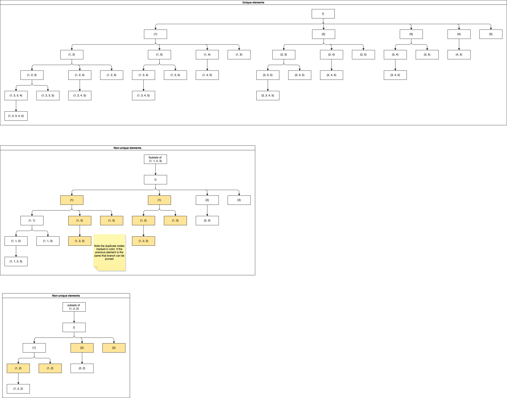
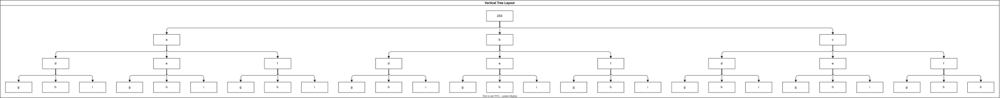
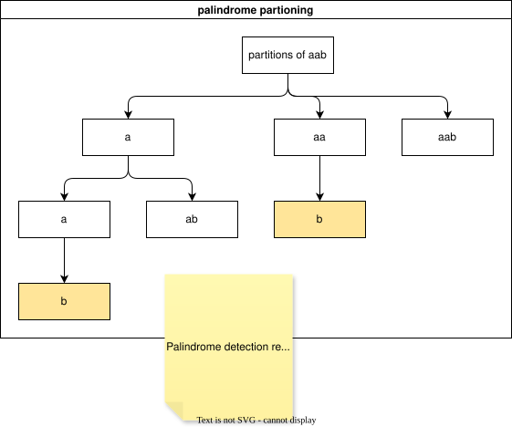
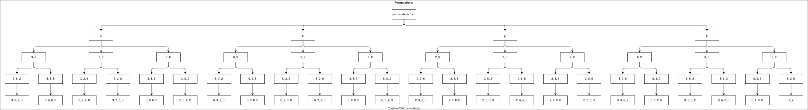
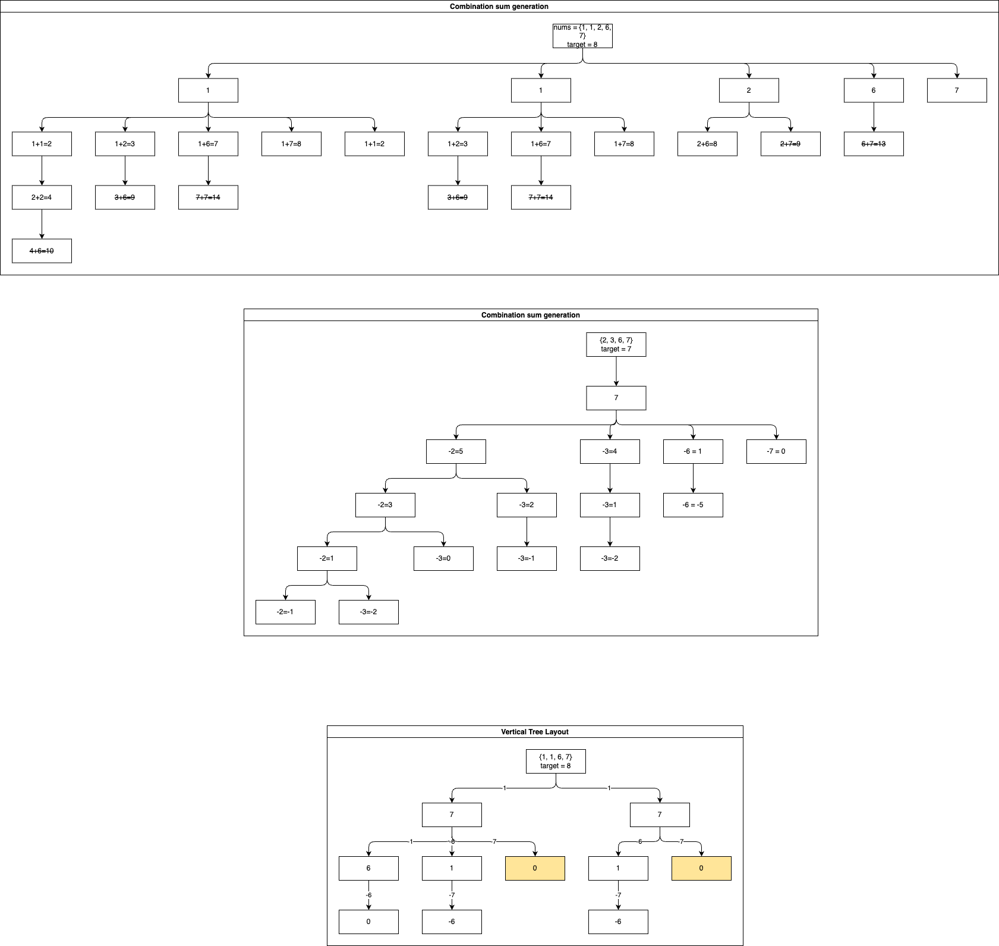
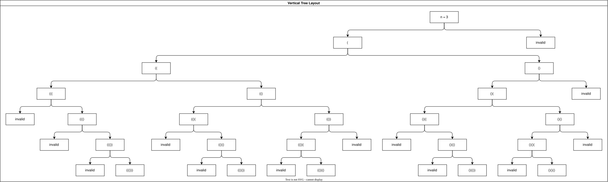

# Backtracking

* Useful for combinatorial search problems.
* Visualize the solution space via a tree
* Algorithm: At each node of the solution tree
  * If the solution is completely formed(typically at the leaf node), save the same
  * For each possible child node from the current node
    * Add information about the branched node to the current path
    * Solve for the child node
    * Backtrack. Remove information pertaining to the child node so that the next child node can be processed 
  * Check for pruning conditions. It may not be necessary to traverse every child node
  * It may be necessary to maintain state during traversal
* Implementation tips
  * Maintain a global variable, typically a list of lists, to accumulate solutions as the algorithm traverses through the solution space
  * Pass a variable to the recursive backtracking function which tracks the current solution as the algorithm traverses through a particular branch
  * If the global solution is a list of lists be careful of how the initial list is initialized.
  ``results.add(new ArrayList<>(path_solution))``
  * 

## Solution trees
### Subset generation

### Letter combinations

### Palindrome partitioning

### Permutations

### Combination sum

### Valid parenthesis generation

## Comparison
| Problem                      | State | Branching strategy                                         | Solutions     | Pruning | Complexity   | Balanced tree |
|------------------------------|-------|------------------------------------------------------------|---------------|---------|--------------|---------------|
| Subset generation            | No    | For all subsets starting with the next subsequent elements | At all nodes  | No      | 2n | No            |
| Palindrome partitioning      | No    |                                                            | At leaf nodes | Yes     | n!           | No            |
| Phone letter combinations    | No    |                                                            | At leaf nodes | No      | 2n | Yes           |
| Permutations                 | Yes   |                                                            | At leaf nodes | No      | n!           | Yes           |
| Combination sum              | Yes   |                                                            | At leaf nodes | Yes     | n!           | No            |
| Valid parenthesis generation | Yes   |                                                            | At leaf nodes | Yes     | 2n | No            |

## References
* https://algo.monster/problems/backtracking

