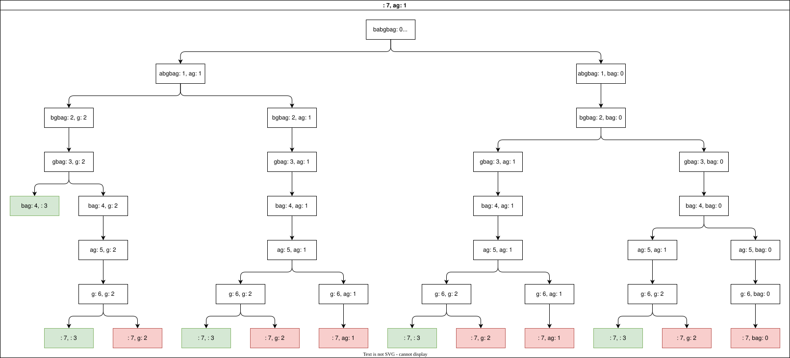

# Distinct subsequences


## Formulation
```text
Let c[i, j] be the number of distinct subsequences, t[j..m] in s[i..n]

c[i, j] = 1 if j == m

c[i, j] = 0 if i == n

c[i, j] = c[i + 1, j + 1] + c[i + 1, j]  iff s[i] == t[j]

c[i, j] = c[i + 1, j] iff s[i] != t[j]
```

## Complexity
O(2<sup>n</sup>) without memoization. 
The depth of the tree will be `n`, the length of s, in the worst case.
This is because we scan through the entire length of s trying to match for t.
The base is two because we make the choice of matching or not matching `s[i]` and `t[j]` even when they can be matched.


With memozation, the number of recursive calls in the worst case will be one for every pair of indexes of s and t.

⇒ O(m*n)

# Longest Common subsequence
## Formulation
```text
lcs[i, j] is the lcs of s[i..n] and t[j..m]

lcs[i, j] = max(1 + lcs[i + 1, j + 1] iff s[i] = t[j], lcs[i + 1, j], lcs[i, j + 1])
```

## Complexity
O(3<sup>mn</sup>) for non-memoized solution

There are mxn possible combinations and for each combination there are 3 choices that can be made
- if s[i] = t[j], match 
- Don't match irrespective of s[i] = t[j]. 
  - This can be done two ways. By moving ahead in s or in t

With memoization, only one recursive call per every pair of indexes is done. Hence complexity is `O(mn)`

# Longest increasing path in a matrix

## Formulation

```text

l[i,j] = length of longest path starting from i, j

l[i, j] = max(
                l[i + 1][j] iff l[i + 1][j] > l[i + 1][j] 0 otherwise, 
                l[i - 1][j] iff l[i - 1][j] > l[i - 1][j] 0 otherwise, 
                l[i][j + 1] iff l[i][j + 1] > l[i][j + 1] 0 otherwise, 
                l[i][j - 1] iff l[i][j - 1] > l[i][j - 1] 0 otherwise
             )
```

## Complexity
There are 4 choices at every position in the matrix in the worst case. So the complexity is O(2<sup>mn</sup>)

With memoization, there will be exactly 1 recursive call per position in the matrix. Complexity is O(mn)